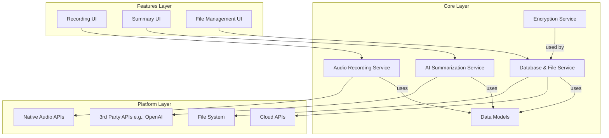
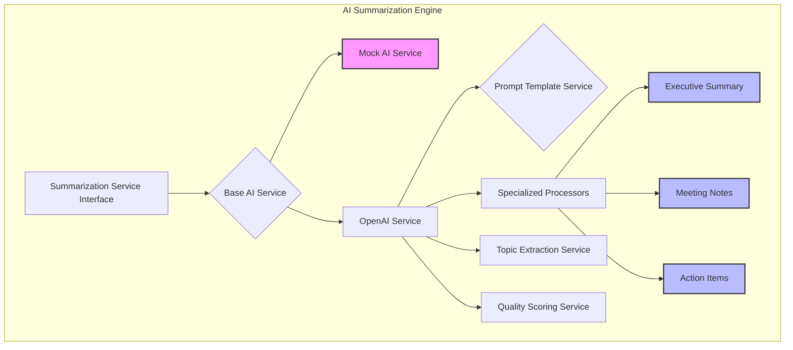
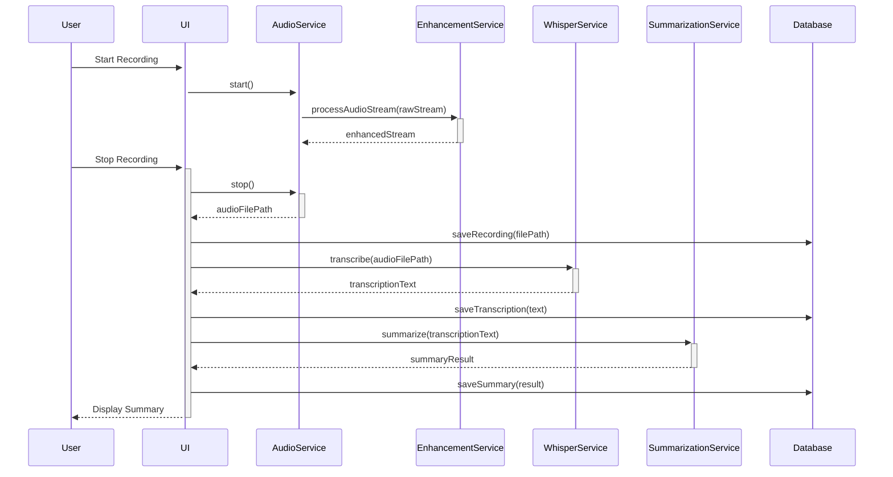

# Meeting Summarizer - Software Architecture

This document provides a comprehensive overview of the software architecture for the Meeting Summarizer application. The architecture is designed to be scalable, maintainable, and testable, following modern best practices for Flutter development.

## 1. High-Level Architecture

The application follows a **Layered Architecture**, heavily inspired by Clean Architecture principles. This separates concerns, making the codebase easier to manage and evolve. The main layers are:

-   **Features Layer**: Contains all the UI and feature-specific business logic.
-   **Core Layer**: Provides shared services, models, and utilities used across multiple features.
-   **Platform Layer**: Handles platform-specific implementations and interactions with native APIs.



## 2. Directory Structure & Layers

The project structure reflects this layered approach.

-   `meeting_summarizer/lib/features/`: This is the **Features Layer**. Each feature (e.g., `audio_recording`) is a self-contained module with its own data, domain, and presentation sub-layers.
-   `meeting_summarizer/lib/core/`: This is the **Core Layer**. It contains the application's backbone:
    -   `services/`: Reusable business logic like AI summarization, audio enhancement, and encryption.
    -   `database/`: The local SQLite database helper, schema, and migration logic.
    -   `models/`: Shared data models used for database entities, API responses, and application state.
    -   `enums/`: Application-wide enumerations for consistency.

## 3. Key Architectural Components

### 3.1. AI Summarization Engine

The AI Summarization Engine is a sophisticated service-oriented component responsible for generating summaries from transcriptions.



-   **Service Interface**: Defines a contract for summarization, allowing for multiple implementations (e.g., OpenAI, mock for testing).
-   **Prompt Engineering**: A dedicated service manages and formats prompts sent to the AI model, allowing for easy tuning and A/B testing.
-   **Specialized Processors**: A factory pattern is used to select the correct processor for different summary types (e.g., bullet points, executive summary, action items).
-   **Quality Scoring**: An advanced service assesses the quality of generated summaries based on metrics like accuracy, clarity, and relevance.

### 3.2. Database and Encryption

The application uses a local SQLite database for persistent storage, with an optional, transparent encryption layer for sensitive data.

```mermaid
graph TD
    A[Feature Logic] --> B[Encrypted Database Service];
    B --> C[Database Helper];
    B --> D[Encryption Service (AES-256-GCM)];
    C --> E[SQLite Database];
    D --> F[Secure Key Storage];

    subgraph "Core/Database"
        C
        E
    end
    subgraph "Core/Services"
        B
        D
        F
    end
```

-   **Database Helper**: Manages the SQLite connection, schema creation, and migrations.
-   **Encryption Service**: Provides military-grade AES-256-GCM encryption. Keys are securely stored using `flutter_secure_storage`.
-   **Encrypted Database Service**: Acts as a facade, automatically encrypting data before writing to the database and decrypting it upon reading. This makes encryption transparent to the rest of the application.

### 3.3. Audio Processing

Audio processing is split into recording, enhancement, and transcription.

-   **Audio Recording Service**: Manages cross-platform audio capture using native APIs.
-   **Audio Enhancement Service**: A key feature that processes the raw audio stream to improve clarity. It uses FFT-based signal processing for noise reduction, echo cancellation, and automatic gain control. This can be applied in real-time or as a post-processing step.
-   **Whisper API Service**: Integrates with OpenAI's Whisper for speech-to-text transcription. It includes robust error handling, retry mechanisms, and an offline fallback capability.

## 4. Data Flow: From Recording to Summary

The end-to-end data flow illustrates how these components work together.



1.  The **User** starts recording via the **UI**.
2.  The **Audio Service** captures raw audio and pipes it through the **Audio Enhancement Service** for real-time cleanup.
3.  The enhanced audio is saved to a file, and its metadata is stored in the **Database**.
4.  The audio file is sent to the **Whisper Service** for transcription.
5.  The resulting transcription is saved to the **Database**.
6.  The transcription text is sent to the **AI Summarization Service**.
7.  The final summary is saved to the **Database** and displayed to the **User**.

This architecture ensures that each component has a single responsibility, promoting modularity and making the system robust and easy to test.